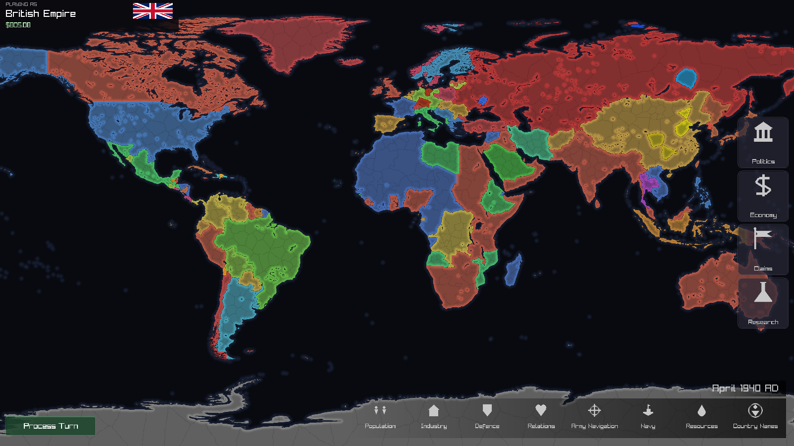
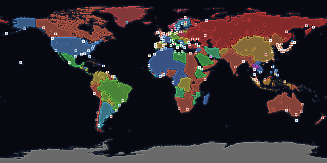
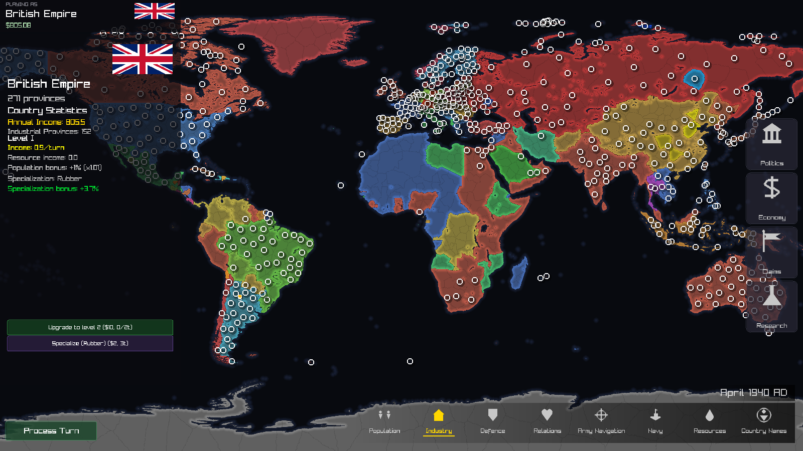
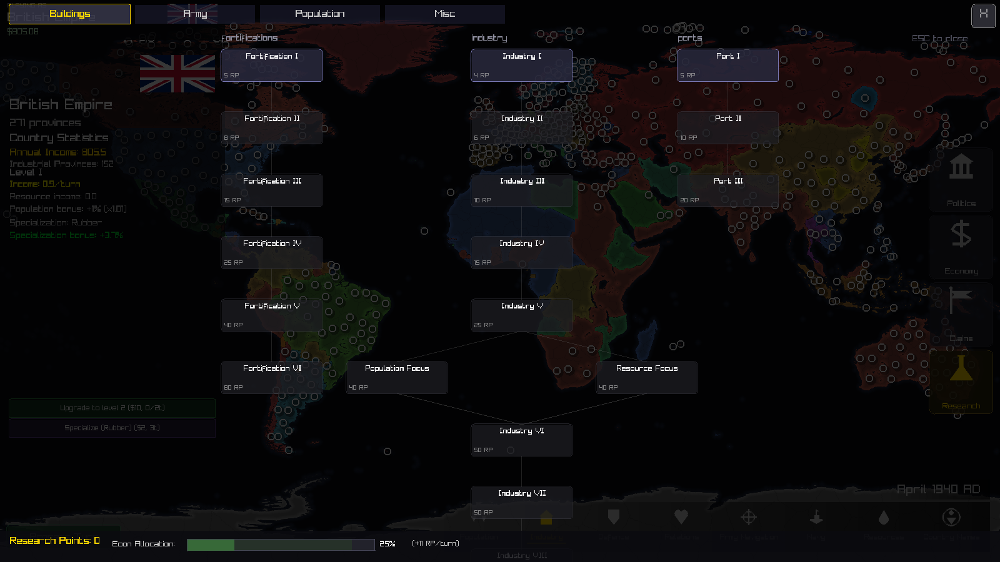
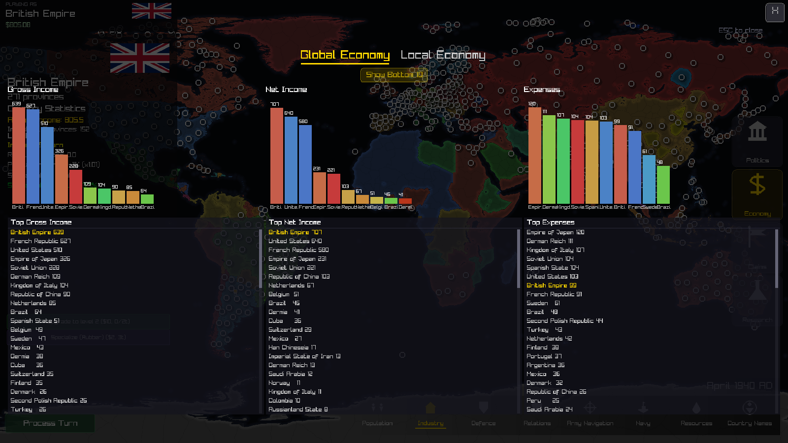
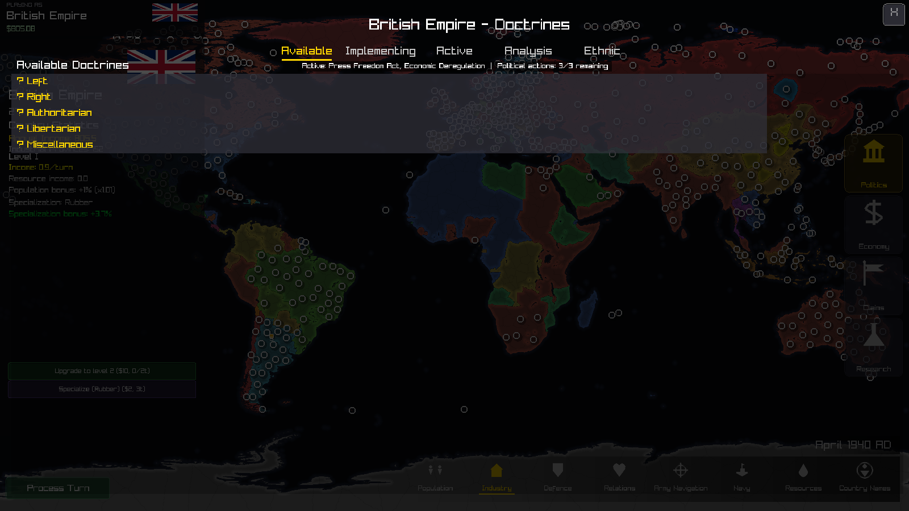
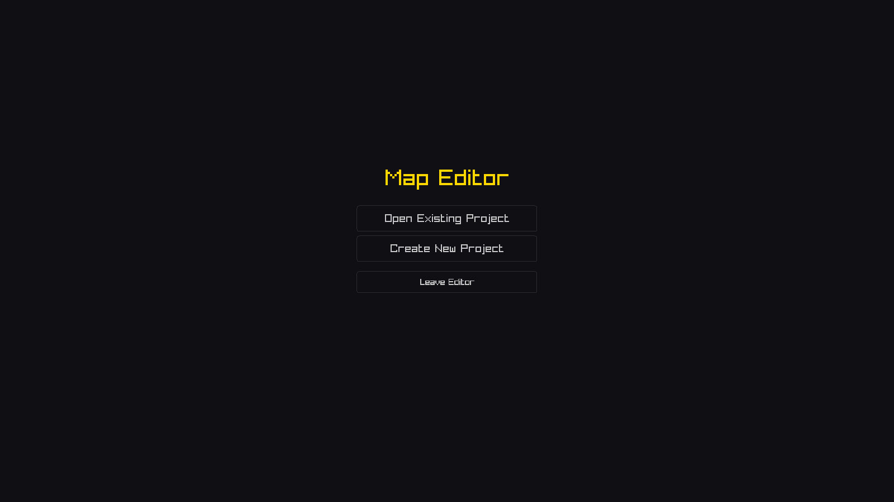
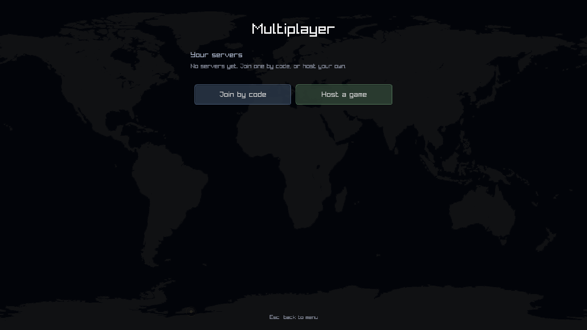
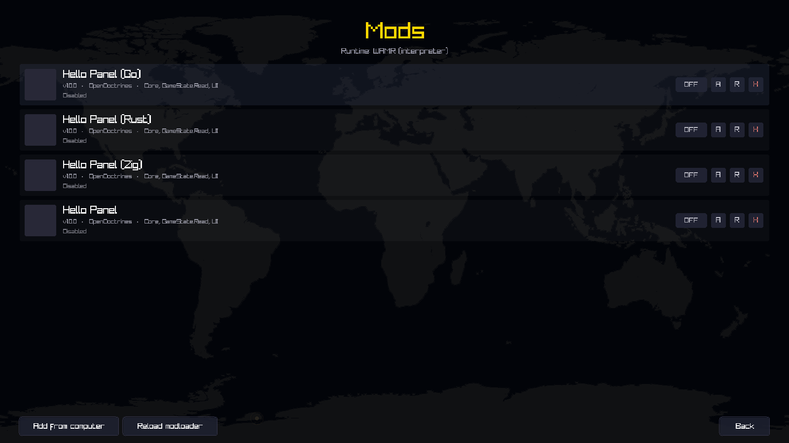

# OpenDoctrines

A grand strategy game about running a country: its industry, its armies, its
research, its politics and its neighbours. Six historical scenarios on a
1641-province world map, a map editor for building your own, multiplayer that
needs no port forwarding, and a mod SDK for thirteen languages.

Alpha. See [Status](#status) for what that word is doing here, and for which
platforms have actually been sat down in front of.



## What a game looks like

Every turn is recorded, so a finished game can be replayed as a timelapse and
exported as a GIF from inside the game. This is the 1939 scenario with every
country played by the AI:



The same history renders as population and as troop concentration:
[population](docs/img/timelapse-population.gif) ·
[troops](docs/img/timelapse-troops.gif).

## The game

Pick a country and run it. Provinces have population, industry, fortification,
resources and an ethnic composition; countries have a treasury, a research
programme, a political compass, claims on their neighbours and opinions about
each other.

**Provinces and countries.** Industry levels and specialisations, forts,
garrisons, ports and navies. Eight map modes: population, industry, defence,
relations, army navigation, navy, resources, country names.



**Research.** A tech tree over fortification, industry, ports and more, funded
by a slider against the rest of your budget.



**Economy.** Gross income, net income and expenses, per country and globally, so
you can see who is actually winning.



**Doctrines.** Policies along a left/right and authoritarian/libertarian
compass, with implementation times, ethnic policy, and the unrest that follows a
bad one.



Rebellions spawn from unrest and hold real territory. Wars pull in guarantee
chains. Ceasefires are negotiated over provinces, money and dropped claims.

### Scenarios

| Scenario | Year | |
|---|------|---|
| Modern Day | 2000    | 185 countries. Population from World Bank totals, deposits from USGS surveys. |
| The Powder Keg | 1914 | Five empires and a continent of alliances waiting on one funeral. |
| The Last Spring | 1918 | Germany has won in the east and is losing in the west. |
| The Gathering Storm | 1939 | Europe on the morning the Wehrmacht crossed the Polish border. |
| Year Zero | 1945 | The war is over and nothing has been settled. |
| The Missile Crisis | 1962 | Two blocs, one ocean between them, and missiles in Cuba. |

### Map editor



Draw land and sea, cut provinces, place countries, populations, resources and
claims, then export a `.odmap` anyone else can load. There is also a procedural
generator for when you want a world rather than a specific one.

## Multiplayer



Players dial **out** over `wss://`, so joining needs no router configuration and
works from a browser tab. Hosting is a listening socket on the host's machine,
and the game can open a [cloudflared](docs/multiplayer-hosting.md) tunnel to it
for you — so in practice there is still nothing to forward, but the host does
need to be a desktop build. **You cannot host from a browser.**

The host is authoritative. State only ever flows server to client, orders are
validated server-side and re-attributed to the authenticated player's country,
and a client never computes a turn. A player who disconnects keeps their seat
and their country: the turn resolves without them, and they get that same
country back when they return.

Detail in [docs/multiplayer.md](docs/multiplayer.md), hosting in
[docs/multiplayer-hosting.md](docs/multiplayer-hosting.md).

## Mods



Mods are WebAssembly, so a mod is the same file on every platform including the
browser, and it runs in a sandbox with a capability grant the player can see and
revoke. The Gearbox SDK has bindings for **C, C++, Rust, Zig, Go, Java, Kotlin,
JavaScript, TypeScript, AssemblyScript, Lua, Python and hand-written WAT** —
every one builds the same example, and the test suite checks that all of them
render byte-identical output.

```bash
tools/gearbox new my-mod        # scaffold (--lang picks the language)
tools/gearbox build my-mod      # compile, pack and verify -> my-mod.odmod
```

[Modding guide](docs/modding.md) · [SDK](docs/gearbox-sdk.md) ·
[ABI reference](docs/gearbox-abi.md) ·
[Troubleshooting](docs/gearbox-troubleshooting.md)

The same material is written up as a wiki, in two places that stay in step: the
[Wiki tab](https://github.com/Pr1nted/Open-Doctrines/wiki) for reading, and
[`wiki/`](wiki/) for reading it here beside the code, with the history and the
diffs. The tree is the source; the Wiki tab is published from it.

## Installing

### macOS — the first launch needs one extra step

The app is **not signed with an Apple Developer ID**, because the project does
not pay for one. macOS therefore refuses to open it the first time:

> **"OpenDoctrines" cannot be opened because the developer cannot be verified.**

That is Gatekeeper doing its job. It is telling you truthfully that Apple has
not vouched for this app — not that anything is wrong with it. You get to make
that call yourself, once:

**Right-click the app → Open → Open.**

Not double-click. Double-clicking gives you the refusal with no way past it;
right-click → Open gives you the same dialog with an **Open** button on it.
macOS remembers the decision, so every launch after the first is normal.

If macOS says the app is *"damaged and can't be opened"*, that is a different
message with a different cause: the download picked up a quarantine flag that
survived being unzipped. Clear it:

```bash
xattr -dr com.apple.quarantine /Applications/OpenDoctrines.app
```

**On macOS the game does not update itself**, for the same reason. A replaced
binary would not carry the approval you just granted, so the update would break
the install; the update button opens the releases page and you install the new
copy the way you installed this one.

Requires **macOS 11 (Big Sur) or later**, Apple Silicon or Intel.

### Linux

Requires **glibc 2.35 or newer** — Ubuntu 22.04, Debian 12, Fedora 36 and
anything more recent. The published binary is built on Ubuntu 22.04, and a glibc
binary does not run on an older glibc than it was built against, so Ubuntu 20.04,
Debian 11 and RHEL 9 need a build from source rather than the download. Building
from source works fine on all of them.

You also need the runtime libraries raylib links against — X11, ALSA and GL.
Every mainstream desktop install already has them; a minimal or headless install
may not.

Only **x86_64** is published. Arm Linux builds from source; GitHub hosts no Arm
Linux runner, so there is no artifact for it.

### Windows

Requires **Windows 10 or later**, 64-bit. The build is unsigned, so SmartScreen
will show *"Windows protected your PC"* on first run — **More info → Run
anyway**.

### Android — experimental

Requires **Android 7.0 (API 24) or later**, **arm64** only. Sideload the APK;
it is signed with a debug key, so Android will ask you to allow installs from
whatever app you downloaded it with.

Call it experimental and mean it. It has been verified on an emulator — the
game boots, loads a world, renders the map and responds to touch — and has
**never run on a physical phone**. What that leaves untested is most of what
makes a phone a phone: how the gestures feel, performance on a real GPU,
thermals, and every screen size that is not the one it was tried at.

Specifically:

- **A controller is the better way to play.** The interface was drawn for a
  mouse, and a pad drives the same pointer, so it fits the game far better than
  fingers do.
- **Touch works but is new.** Tap to click, drag to move the pointer, pinch to
  zoom, long-press for right-click. The pointer stays where you left it, which
  is what keeps hover-driven parts of the interface — ship orders, tooltips —
  working at all.
- **Text is small.** The interface scales up on taller screens, but only as far
  as it can without pushing menu items off the bottom, and on a phone that
  ceiling is low. Laying the screens out for a phone properly is still to do.
- **The map editor is desktop-only in practice.** It has its own input path that
  has not been taught about touch.
- **Mods and multiplayer are not built in** this configuration.
- **It is a large install** — roughly 110 MB downloaded, and the game unpacks
  its content on first run, so budget about twice that on disk. First launch
  therefore takes noticeably longer than later ones.

Build it with `tools/package_android.sh` after configuring with the NDK
toolchain; the CI builds and checks the same APK on every push.

## Building

Needs CMake 3.20+ and a C++20 compiler. Everything else is fetched or vendored.

```bash
cmake -B build -DCMAKE_BUILD_TYPE=Release
cmake --build build -j
```

On Linux, install the X11/ALSA development packages raylib needs first:

```bash
sudo apt-get install -y libasound2-dev libx11-dev libxrandr-dev libxi-dev libgl1-mesa-dev libglu1-mesa-dev libxcursor-dev libxinerama-dev libwayland-dev libxkbcommon-dev
```

Two features are on by default and can be turned off if their dependencies are a
problem: `-DOD_ENABLE_NET=OFF` (multiplayer, needs mbedTLS) and
`-DOD_ENABLE_MODS=OFF` (the mod runtime). The game builds and plays without
either — the menus say the build cannot do it, rather than the build failing.

### Running

```bash
./build/OpenDoctrines                       # the .app bundle on macOS
./build/OpenDoctrines path/to/save.odsv     # straight into a save
```

Non-interactive modes:

```bash
OpenDoctrines --simulate data/STDmaps/1939.odmap 40 "My World"
OpenDoctrines --export-timelapse save.odsv out.gif 960x480 political
OpenDoctrines --screenshots docs/img save.odsv
OpenDoctrines --train-ai
OpenDoctrines --eval-ai
```

`--simulate` plays a scenario with every country AI-driven and leaves a save
with its full turn history — which is where the timelapses above come from. It
is also the smallest end-to-end check that a build actually works: it loads a
map, resolves turns and writes an archive with nobody at the keyboard.

`--train-ai [maps] [turnsPerMap] [countries] [seed]` runs self-play on freshly
generated maps and improves `data/ai/model.bin`. `--eval-ai [maps]
[turnsPerMap] [seed] [difficulty]` plays that model over a fixed set of seeded
maps *without* learning from them and reports what it did, so two model versions
can be compared on the same worlds. Add `--vs-random` to it and half the
countries play uniformly at random instead — the one measurement with an
absolute answer. `--vs-model <path>` gives that half a named model file rather
than dice, which is what to use once the coin flip is beaten: random never
improves, so it can only ever answer "better than nothing", while a pinned
opponent is a rung you can replace with a harder one.

Both modes play generated maps by default. `--scenarios` measures on the six
worlds in `data/STDmaps` instead — the ones the new-game menu offers — and
training now plays one every third round, so the AI is no longer meeting 1939
for the first time in your game.

```bash
tools/train_parallel.py --workers 3 --limit 90    # several worlds at once
OpenDoctrines --eval-ai --vs-random               # does it beat a coin flip?
OpenDoctrines --eval-ai --vs-model rung1.bin      # does it beat that model?
OpenDoctrines --eval-ai 6 400 --scenarios         # on the maps people play
```

Add `--resource-limit 90` to cap any run at a share of the machine for that run
only. See [the AI architecture page](wiki/AI-Architecture.md) for what the model
is and how it is trained.

## Tests

```bash
tests/run_all.sh build
```

Mod archive, runtime, manager and ABI conformance; every SDK's example rebuilt
from source and compared byte for byte; the network protocol against hostile
input; crypto against RFC vectors; a real host and four real players over
loopback; the GIF encoder decoded back with Pillow; and drift checks that fail
if generated bindings, third-party notices or flag licences fall out of date.

Multiplayer specifically:

```bash
tools/playtest.sh            # four windows, four different players
tools/playtest.sh --verify   # the same rules checked with nobody at the keyboard
```

See [docs/multiplayer-testing.md](docs/multiplayer-testing.md).

Every image in this README is regenerated by `tools/screenshots.sh`, against a
throwaway install and a simulated world, so they can be retaken after any change
instead of going quietly out of date.

## Status

Alpha, and the honest version of that word:

- **Platforms.** macOS (arm64) is the one the test suite has been run on end to
  end. Windows, Linux and web are built by CI and are targeted, not yet
  qualified — the four-platform matrix in `.github/workflows/release-game.yml`
  compiles them, and "it compiled" is not "somebody played it". Qualifying them
  means `tests/run_all.sh` and `tools/playtest.sh --verify` passing on each.
- **The AI is not yet a real opponent.** It is a neural network trained by
  self-play, and it is still learning: on this build it holds 36% of the world
  against countries that pick uniformly at random from the same legal moves, so
  it is currently *losing* to chance. It defends its borders, mounts amphibious
  invasions, negotiates and governs — the mechanisms work — but it will not
  outplay you, and the difficulty setting changes how much noise it adds to its
  own choices rather than how well it plays. Retraining is ongoing. Measure the
  current build yourself with `OpenDoctrines --eval-ai --vs-random`; the line to
  read is `ADVANTAGE`, where 1.0 means "no better than a coin flip".
- Multiplayer works: hosting, joining, seats, turns, disconnects and reconnects
  are built and tested. There is **no dedicated server** yet — hosting means a
  running copy of the game, and closing it ends the session.
- There is **no tutorial**. Province actions live behind the view tabs on the
  bottom bar, and the game does not currently tell you that.
- **Long-form (play-by-paste) turns are built but not yet played.** The whole
  path exists — the host publishes each resolved turn to a store, players submit
  orders sealed with a session key, and both sides work with the host offline —
  across all four stores, including manual copy and paste. It is covered by unit
  tests and the server half by `net/test/longform.test.ts`, and the game's URLs
  have been checked against a locally running Worker. What has *not* happened is
  a real campaign: two machines, several days, a host that closes its laptop.
  Until somebody does that, treat it as untested rather than finished.

Known gaps are tracked in the issue tracker, kept as a record of what is
actually true rather than what would be nice.

## Licence

[OpenDoctrines Non-Commercial License](LICENSE). Free to play, modify and share
non-commercially; the mods, maps, saves and videos you make are yours.
Third-party data and libraries are credited in [NOTICE.md](NOTICE.md), generated
from `tools/provenance.json` and checked in CI so attribution cannot silently
drift.

[Contributing](CONTRIBUTING.md) · [Code of conduct](CODE_OF_CONDUCT.md)
