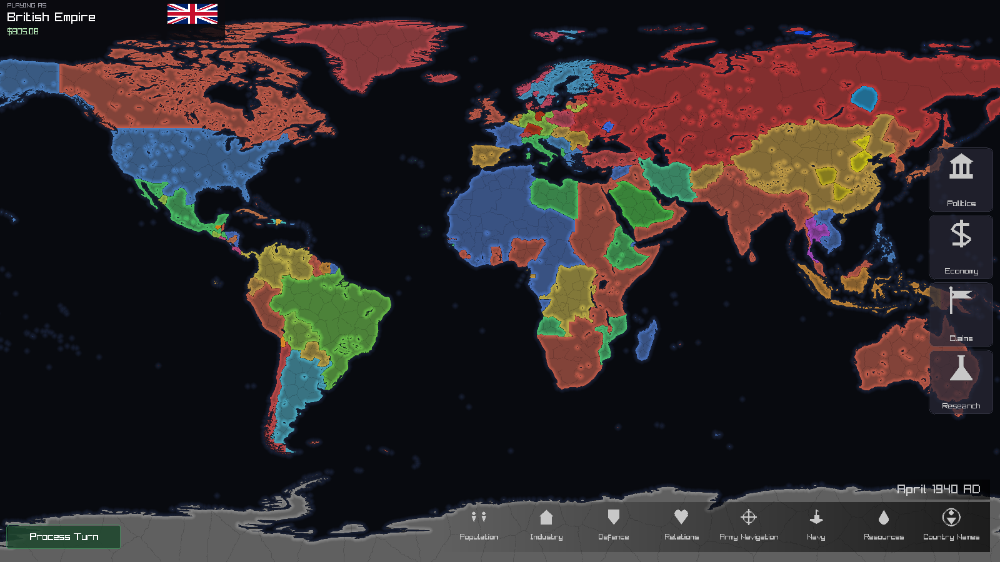
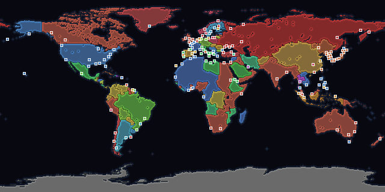
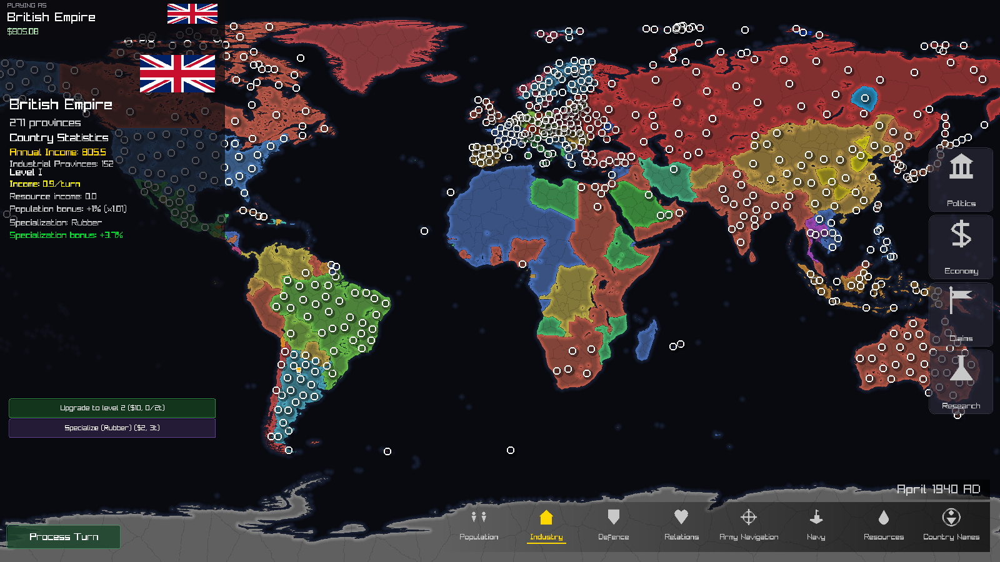
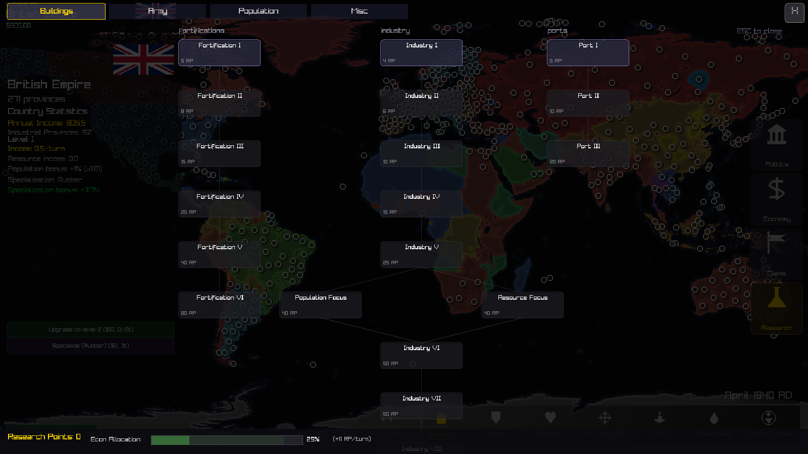
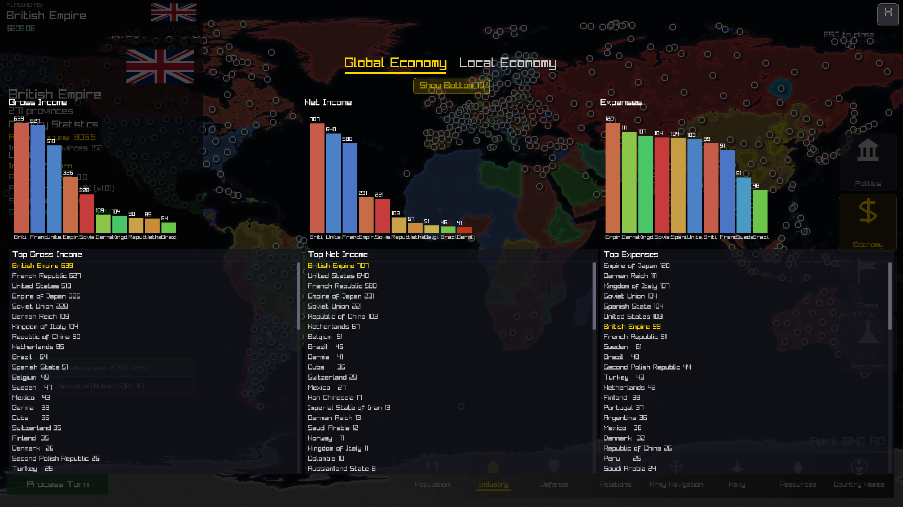
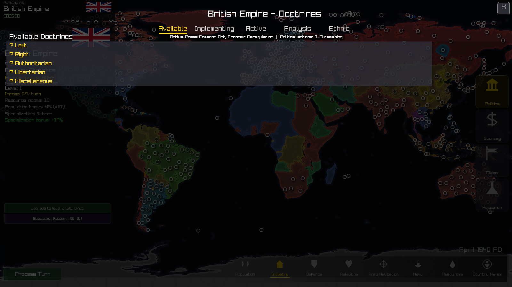
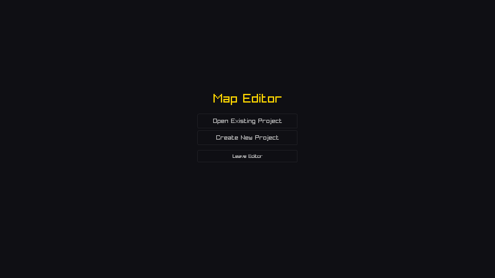
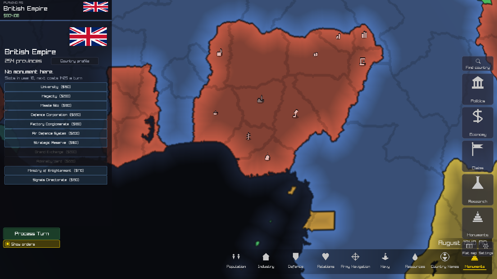
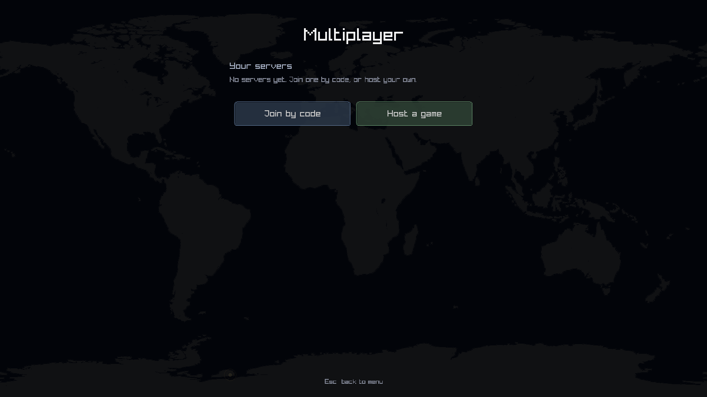
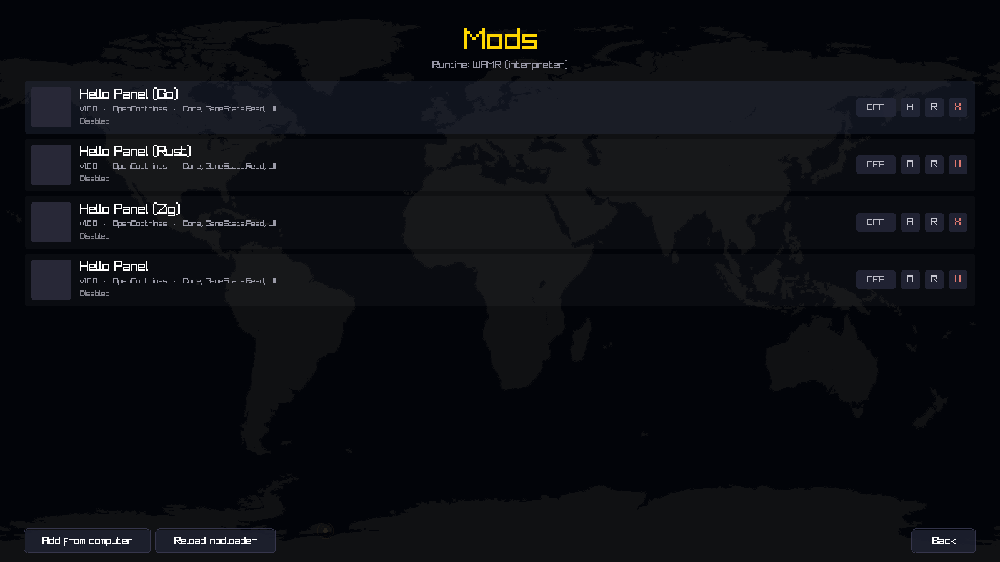

# OpenDoctrines

[](https://ko-fi.com/N2C128735I)

**A free, source-available grand strategy game that runs in a browser.**

It works the way Hearts of Iron IV and Victoria do: provinces with population
and industry, a research tree, doctrines you have to live with once you pick
them, and war, rebellion and diplomacy across a world map. It plays on Windows, macOS,
Linux, Android, **in a browser tab with no download and no account** — and,
since v1.2.2a, on [TempleOS](#templeos). It costs nothing on every one of
them.

[**Play it in your browser**](https://pr1nted.itch.io/open-doctrines) ·
[Downloads](https://github.com/Pr1nted/Open-Doctrines/releases) ·
[Discord](https://discord.gg/wqS65jzVv5) ·
[Ko-fi](https://ko-fi.com/pr1nted)

A grand strategy game about running a country: its industry, its armies, its
research, its politics and its neighbours. Ten scenarios — six historical,
three alternate histories and a flooded Mars — on a 1,642-province world map, a
map editor for building your own, multiplayer that needs no port forwarding,
and a mod SDK for thirteen languages.

Alpha. [Status](#status) says what that means here, and which platforms
anyone has actually sat down and played it on.



## What a game looks like

Every turn is recorded, so a finished game can be replayed as a timelapse and
exported as a GIF from inside the game. This is the 1939 scenario with every
country played by the AI:



The same history renders as population and as troop concentration:
[population](docs/img/timelapse-population.gif) ·
[troops](docs/img/timelapse-troops.gif).

## The game

Pick a country and run it. Provinces have population, industry, fortification,
resources and an ethnic composition; countries have a treasury, a research
programme, a political compass, claims on their neighbours and opinions about
each other.

**Provinces and countries.** Industry levels and specialisations, forts,
garrisons, ports and navies. Nine map modes: population, industry, defence,
relations, army navigation, navy, resources, country names, monuments.

A province can only take so much industry. The ceiling comes from its
population, how tightly that population lives, how big it is and what is in
the ground. So you cannot buy the same factory everywhere — you have to hold
the places worth building in.



**Research.** A tech tree over fortification, industry, ports and more, funded
by a slider against the rest of your budget.



**Economy.** Gross income, net income and expenses, per country and globally, so
you can see who is actually winning.



**Sector taxes.** A rate per resource speciality — oil, metal, rubber, gold,
gems — positive a tax on what those provinces earn, negative a subsidy paid out
of the treasury. The price runs the other way: a taxed sector is dearer to run
and dearer to specialise into, so it is money now against a weaker sector
later. A rate is a target rather than a switch — it moves two points a turn, so
a sector cannot be taxed for one turn and relieved the next — and how far
either way you may go is a ceiling your doctrines set.

**Nationalisation.** Take a speciality into state hands and every province
specialised in it is dearer to build, dearer to run and produces more, all
three from one ramp that climbs over twenty turns and decays at the same rate.
That is what stops the obvious trick of building cheap, collecting high and
privatising before the bill: by the time the output is high the upkeep is too,
and releasing loses the output over the same twenty turns it took to gain. How
many specialities you may hold at once comes off the economic axis of your
compass — five at the far left, none at the far right — so a country that
drifts right has to let one go.

**Doctrines.** Policies along a left/right and authoritarian/libertarian
compass, with implementation times, ethnic policy, and the unrest that follows a
bad one.



Unrest turns into rebellions, and rebels hold real ground. Declaring war
drags in everyone who guaranteed the other side. Ceasefires are haggled over:
provinces, money, and claims you agree to drop.

### Scenarios

Six of them happened. Three are the same world with one thing decided the
other way. One is not this planet.

| Scenario | Year | |
|---|------|---|
| Modern Day | 2000    | 185 countries. Population from World Bank totals, deposits from USGS surveys. |
| The Powder Keg | 1914 | Five empires and a continent of alliances waiting on one funeral. |
| The Last Spring | 1918 | Germany has won in the east and is losing in the west. |
| The Gathering Storm | 1939 | Europe on the morning the Wehrmacht crossed the Polish border. |
| Year Zero | 1945 | The war is over and nothing has been settled. |
| The Missile Crisis | 1962 | Two blocs, one ocean between them, and missiles in Cuba. |
| **Mitteleuropa** | 1936 | The Entente lost. Germany holds central Europe through a ring of client kingdoms whose borders it wrote, Austria-Hungary survived its own succession — and in the steppe and the forests there are people who never stopped shooting at it. |
| **The Long Occupation** | 1962 | Twenty years under an occupation meant to be permanent. You are not it: you are a government that got out, a command that never surrendered, or a partisan republic holding a stretch of mountain. |
| **The Three Superstates** | 1984 | Three powers divide the world and none can conquer another. The war is permanent and fought over the belt of contested countries between them, for their labour and because a war that cannot be won need never end. After Orwell. |
| **Mars** | — | Real Martian topography with the basins flooded. Every sea is a named basin — Hellas, Utopia, Chryse, Argyre — and every state stands on the highlands between them. |

There is also a **tutorial** map: two islands, three small countries and
nothing at stake.

### Map editor



Draw land and sea, cut provinces, place countries, populations, resources and
claims, then export a `.odmap` anyone else can load. There is also a procedural
generator for when you want a world rather than a specific one.

## Monuments



One great work per province -- a university, a megacity, a missile silo that
reaches over the curve of the planet -- and a rent for having it switched on.
Slots cost 50, 75, 125, 200, 300 a turn, so eleven monuments and money for four
is a decision you make every turn rather than a shopping list you finish.

On the globe they stand up out of the province. They are built from a
province's own panel, because where one stands is most of what it does, and
switched on and off from the Monuments screen, because that part is about a
budget and not a place.

Detail, including what each one does and how to reach them from a map script or
a mod, in [docs/monuments.md](docs/monuments.md).

## Multiplayer



Joining is an outgoing connection over `wss://`, so there is nothing to set up
on your router and it works from a browser tab. Hosting opens a socket on the
host's machine, and the game can put a [cloudflared](docs/multiplayer-hosting.md)
tunnel in front of it for you — so there is still nothing to forward, but the
host has to be a desktop build. **You cannot host from a browser.**

The host decides everything. Turns are worked out there and sent to the
players; your own copy of the game never computes one. Orders are checked on
the host and applied to the country you actually signed in as. If you drop out
you keep your seat: the turn resolves without you, and you get the same
country back when you return.

**Finding people to play with** used to be the hard part. Multiplayer →
*Looking for a game* lists the open ones. Post that you are hosting and it
shows up in the game and in the Discord channel at the same time — one board,
two windows onto it.

Detail in [docs/multiplayer.md](docs/multiplayer.md), hosting in
[docs/multiplayer-hosting.md](docs/multiplayer-hosting.md), the board in
[docs/looking-for-a-game.md](docs/looking-for-a-game.md).

## Mods



Mods are WebAssembly, so one file works everywhere, browser included. Each one
runs in a sandbox, and the player can see what it is allowed to do and take
that away. The Gearbox SDK has bindings for **C, C++, Rust, Zig, Go, Java, Kotlin,
JavaScript, TypeScript, AssemblyScript, Lua, Python and hand-written WAT** —
every one builds the same example, and the test suite checks that all of them
render byte-identical output.

```bash
tools/gearbox new my-mod        # scaffold (--lang picks the language)
tools/gearbox build my-mod      # compile, pack and verify -> my-mod.odmod
```

[Modding guide](docs/modding.md) · [SDK](docs/gearbox-sdk.md) ·
[ABI reference](docs/gearbox-abi.md) ·
[Troubleshooting](docs/gearbox-troubleshooting.md)

The same material is also a wiki, in two places that stay in step: the
[Wiki tab](https://github.com/Pr1nted/Open-Doctrines/wiki) to read on its own,
and [`wiki/`](wiki/) to read here next to the code with its history. The files
are the source; the Wiki tab is published from them.

## Installing

### macOS — the first launch needs one extra step

The app is **not signed with an Apple Developer ID**, because the project does
not pay for one. macOS therefore refuses to open it the first time:

> **"OpenDoctrines" cannot be opened because the developer cannot be verified.**

That is Gatekeeper doing its job. It is telling you truthfully that Apple has
not vouched for this app — not that anything is wrong with it. You get to make
that call yourself, once:

**Right-click the app → Open → Open.**

Not double-click. Double-clicking gives you the refusal with no way past it;
right-click → Open gives you the same dialog with an **Open** button on it.
macOS remembers the decision, so every launch after the first is normal.

If macOS says the app is *"damaged and can't be opened"*, that is a different
message with a different cause: the download picked up a quarantine flag that
survived being unzipped. Clear it:

```bash
xattr -dr com.apple.quarantine /Applications/OpenDoctrines.app
```

**On macOS the game does not update itself**, for the same reason. A replaced
binary would not carry the approval you just granted, so the update would break
the install; the update button opens the releases page and you install the new
copy the way you installed this one.

Requires **macOS 11 (Big Sur) or later**, Apple Silicon or Intel.

### Linux

Requires **glibc 2.35 or newer** — Ubuntu 22.04, Debian 12, Fedora 36 and
anything more recent. The published binary is built on Ubuntu 22.04, and a glibc
binary does not run on an older glibc than it was built against, so Ubuntu 20.04,
Debian 11 and RHEL 9 need a build from source rather than the download. Building
from source works fine on all of them.

You also need the runtime libraries raylib links against — X11, ALSA and GL.
Every mainstream desktop install already has them; a minimal or headless install
may not.

**x86_64 and arm64** are published in every format; **32-bit x86, 32-bit Arm
(armv7, e.g. a Raspberry Pi running a 32-bit OS) and RISC-V (riscv64)** as the
tarball:

| | what it is | arches | glibc |
|---|---|---|---|
| `.tar.gz` | the binary and its data, unpack anywhere | x86_64, arm64, x86, armv7, riscv64 | needs 2.35+ (riscv64: 2.39+, e.g. Ubuntu 24.04, Debian 13) |
| `.deb` | Debian, Ubuntu, Mint — `sudo apt install ./opendoctrines_*.deb` | x86_64, arm64 | needs 2.35+ |
| `.rpm` | Fedora, RHEL, openSUSE — `sudo dnf install ./opendoctrines-*.rpm` | x86_64, arm64 | needs 2.35+ |
| `.AppImage` | one file, no install — `chmod +x` and run | x86_64, arm64 | needs 2.35+ |
| Flatpak | `flatpak install` — **the only one that works on older glibc** | x86_64 | brings its own |

The x86, armv7 and riscv64 builds are cross-compiled and their test suite runs
under emulation; none has been played on a physical board yet. On armv7 and
riscv64 the Tor Project publishes no `tor` to bundle, so Tor connections use an
installed one (`apt install tor`), as on arm64. riscv64 has no tunnel helper
(cloudflared builds none), so hosting through a tunnel is unavailable there;
direct and relayed connections are unaffected.

The AppImage needs **`fusermount`** to mount itself, and several distributions
ship the FUSE *libraries* without that *binary* — Debian 12 among them, where
you get

```
Error: No suitable fusermount binary found on the $PATH
```

which is about your machine and not about the download. Install it
(`sudo apt install fuse`, or `sudo dnf install fuse`), or skip FUSE entirely:

```bash
./OpenDoctrines-*.AppImage --appimage-extract-and-run
```

An AppImage bundles the application's libraries but **not** the C library under
them, so it is not a way around the glibc requirement. On Debian 11, Ubuntu
20.04 or RHEL 9, use the Flatpak or build from source.

### FreeBSD and OpenBSD

Both are built and published as **amd64** zips, the same shape as every other
desktop download, by each system's own compiler inside a real VM — not
cross-compiled from Linux. Unpack and run.

You need the usual X11, Mesa and ALSA runtime libraries. On FreeBSD they are
ports (`pkg install mesa-libs libX11 libXrandr libXi libXcursor libXinerama
libxkbcommon`); on OpenBSD X and Mesa are already in base.

**Mods do not work on OpenBSD, and the build says so rather than pretending.**
The Gearbox mod runtime is [WAMR](https://github.com/bytecodealliance/wasm-micro-runtime),
which has no OpenBSD port, and OpenBSD's W^X policy is a poor fit for an
interpreter that wants pages it can write and then execute. The OpenBSD build
is compiled with the runtime left out: there is no mod menu, rather than one
that is there and does nothing. Everything else — the full game, scenarios,
saves, multiplayer — is unaffected. FreeBSD has mods as normal.

Porting the runtime is a separate piece of work and not scheduled.

### Windows

Requires **Windows 10 or later**. Three builds are published:

| download | for |
|---|---|
| `windows-x64` | almost every PC — and it also runs on Arm PCs, under emulation |
| `windows-arm64` | Arm PCs (Snapdragon and similar), natively |
| `windows-x86` | 32-bit Windows. On 64-bit Windows it can use 4 GB; on a 32-bit Windows, 2 GB |

The build is unsigned, so SmartScreen will show *"Windows protected your PC"*
on first run — **More info → Run anyway**.

### Android — experimental

Requires **Android 7.0 (API 24) or later**, **arm64** only. Sideload the APK;
it is signed with a debug key, so Android will ask you to allow installs from
whatever app you downloaded it with.

Call it experimental and mean it. It has been verified on an emulator — the
game boots, loads a world, renders the map and responds to touch — and has
**never run on a physical phone**. What that leaves untested is most of what
makes a phone a phone: how the gestures feel, performance on a real GPU,
thermals, and every screen size that is not the one it was tried at.

Specifically:

- **A controller is the better way to play.** The interface was drawn for a
  mouse, and a pad drives the same pointer, so it fits the game far better than
  fingers do.
- **Touch works but is new.** Tap to click, drag to move the pointer, pinch to
  zoom, long-press for right-click. The pointer stays where you left it, which
  is what keeps hover-driven parts of the interface — ship orders, tooltips —
  working at all.
- **Text is small.** The interface scales up on taller screens, but only as far
  as it can without pushing menu items off the bottom, and on a phone that
  ceiling is low. Laying the screens out for a phone properly is still to do.
- **The map editor is desktop-only in practice.** It has its own input path that
  has not been taught about touch.
- **Mods and multiplayer are not built in** this configuration.
- **It is a large install** — roughly 110 MB downloaded, and the game unpacks
  its content on first run, so budget about twice that on disk. First launch
  therefore takes noticeably longer than later ones.

Build it with `tools/package_android.sh` after configuring with the NDK
toolchain; the CI builds and checks the same APK on every push.

### TempleOS

There is a TempleOS version. It is a separate build of the game, written in
HolyC, and the whole thing runs on that machine: the map, the rules and the
AI. Nothing is sent to another computer.

You need TempleOS in a virtual machine — QEMU, Bochs or VirtualBox. It will
not work on a real PC. The game needs a screen mode TempleOS can only reach
through registers those emulators provide and real graphics cards do not.

Download [the TempleOS release][tos-rel], then:

1. Start TempleOS in your VM.
2. Copy every file from the zip into `D:/Home`. The easiest way is to shut the
   VM down and mount its disk image on your own computer — TempleOS uses
   FAT32, so Windows, macOS and Linux can all open it. `templeos/vm.sh push`
   in this repository does it for you if you use QEMU.
3. Start the VM again and type:

   ```
   #include "ODGame"
   ODStart;
   ```

That builds the game — about 1.7 seconds — and opens the menu. Pick a country
and play.

If you would rather not build it, the zip also has `ODBIN.BIN`, the game
already compiled:

```
#include "RUN"
U0 (*f)(U8 *w) = ODStart;
(*f)("world.odw");
```

Three lines instead of one because of how TempleOS loads things;
[templeos/README.md](templeos/README.md) explains it.

**Controls.** Click a province, or press `n` to move to one next to it, or
`h` and `l` to step through your own. Press `?` for every key.

**What it has:** 1,632 provinces, all 39 actions the desktop game has, all 8
map views, 86 technologies, 59 policies, fleets and a sea to sail them on.

**What it does not:** multiplayer. There is a working network driver in
`templeos/Net.HC` — TempleOS ships without one — but no game uses it yet.

[tos-rel]: https://github.com/Pr1nted/Open-Doctrines/releases/tag/templeos-v1.2.2a

## Building

Needs CMake 3.20+ and a C++20 compiler. Everything else is fetched or vendored.

```bash
cmake -B build -DCMAKE_BUILD_TYPE=Release
cmake --build build -j
```

On Linux, install the X11/ALSA development packages raylib needs first:

```bash
sudo apt-get install -y libasound2-dev libx11-dev libxrandr-dev libxi-dev libgl1-mesa-dev libglu1-mesa-dev libxcursor-dev libxinerama-dev libwayland-dev libxkbcommon-dev
```

Two features are on by default and can be turned off if their dependencies are a
problem: `-DOD_ENABLE_NET=OFF` (multiplayer, needs mbedTLS) and
`-DOD_ENABLE_MODS=OFF` (the mod runtime). The game builds and plays without
either — the menus say the build cannot do it, rather than the build failing.

### Running

```bash
./build/OpenDoctrines                       # the .app bundle on macOS
./build/OpenDoctrines path/to/save.odsv     # straight into a save
```

### Languages

The game ships in fourteen languages. The picker is a flag beside the gear on
the main menu, and a tab of its own in Settings; both list every language by its
own name, with the flag, and carry the warning that everything but English was
machine-translated.

The English text IS the key — `T("New World")` looks itself up and falls back to
itself — so a missing translation shows English rather than a blank, and the
English build has no lookup on its path at all. The pieces:

```bash
python3 tools/i18n_extract.py          # source -> data/lang/en.json
python3 tools/i18n_extract.py --check  # fail if the two have drifted
python3 tools/i18n_sync.py             # carry en.json's keys into every language
python3 tools/i18n_sync.py --report    # how complete each one is
python3 tools/i18n_wrap.py <files>     # wrap drawn literals in T()
python3 tools/i18n_put.py de < batch.json
```

Two things are worth knowing before adding to it. Text is drawn through
shadowed `DrawText`/`MeasureText` (`src/i18n/Text.h`, the trick `UiScale.h`
already uses) because raylib's built-in font is ASCII and the game has ~970
calls against it; pure-ASCII strings still go straight to raylib untouched. And
the font atlas is rebuilt per language from exactly the glyphs that language
uses, which is what makes 日本語 cost 982 glyphs rather than a CJK font.

Place names are not translated but transliterated — the names this game
generates are invented, so "Brelland" becomes Брелланд, ブレルランド or 巴拉-style
Han by sound. A real place with a real name goes in `data/lang/<code>.names.json`
instead, which wins over the transliteration.

Non-interactive modes:

```bash
OpenDoctrines --simulate data/STDmaps/1939.odmap 40 "My World"
OpenDoctrines --export-timelapse save.odsv out.gif 960x480 political
OpenDoctrines --screenshots docs/img save.odsv
OpenDoctrines --tutorial-walk
OpenDoctrines --train-ai
OpenDoctrines --eval-ai
```

`--tutorial-walk` plays every route of the tutorial page by page -- the opening
conversation, the beginner lesson, the topic menu and each of its five topics,
and the sign-off -- and reports every page that points at an element nothing
drew, waits on a condition that never comes true, names a speaker who is not in
the cast, or offers a choice that opens a script which is not there. It exits
non-zero if it finds any, so a lesson that has drifted away from the interface
it describes fails a build rather than a player.

It is mostly a deadlock hunt. For every page that waits, it asks whether the
control that would satisfy the condition can actually be clicked -- the gate
allows back exactly one rectangle, and if that is not the one with the button
in it the player can see what to do and cannot do it -- whether the condition
needs a turn the button is still locked against, and, for the diplomacy pages,
whether the entry being waited for is one that relationship's panel even
offers. It ends by proving the way out: Escape to the pause menu from a gated
page, and "Stop the tutorial" actually stopping it.

Both of these tools reload a world per step and take minutes end to end.
`OD_WALK_ONLY=name,name` narrows the walk to particular routes, and
`OD_SHOT_ONLY=name,name` narrows `--screenshots` to particular screens, which
is what to use while working on one of them.

`--simulate` plays a scenario with every country AI-driven and leaves a save
with its full turn history — which is where the timelapses above come from. It
is also the smallest end-to-end check that a build actually works: it loads a
map, resolves turns and writes an archive with nobody at the keyboard.

`--train-ai [maps] [turnsPerMap] [countries] [seed]` runs self-play on freshly
generated maps and improves `data/ai/model.bin`. `--eval-ai [maps]
[turnsPerMap] [seed] [difficulty]` plays that model over a fixed set of seeded
maps *without* learning from them and reports what it did, so two model versions
can be compared on the same worlds. Add `--vs-random` to it and half the
countries play uniformly at random instead — the one measurement with an
absolute answer. `--vs-model <path>` gives that half a named model file rather
than dice, which is what to use once the coin flip is beaten: random never
improves, so it can only ever answer "better than nothing", while a pinned
opponent is a rung you can replace with a harder one.

Both modes play generated maps by default. `--scenarios` measures on the six
worlds in `data/STDmaps` instead — the ones the new-game menu offers — and
training now plays one every third round, so the AI is no longer meeting 1939
for the first time in your game.

```bash
tools/train_parallel.py --workers 3 --limit 90    # several worlds at once
OpenDoctrines --eval-ai --vs-random               # does it beat a coin flip?
OpenDoctrines --eval-ai --vs-model rung1.bin      # does it beat that model?
OpenDoctrines --eval-ai 6 400 --scenarios         # on the maps people play
```

Add `--resource-limit 90` to cap any run at a share of the machine for that run
only. See [the AI architecture page](wiki/AI-Architecture.md) for what the model
is and how it is trained.

## Tests

```bash
tests/run_all.sh build
```

Mod archive, runtime, manager and ABI conformance; every SDK's example rebuilt
from source and compared byte for byte; the network protocol against hostile
input; crypto against RFC vectors; a real host and four real players over
loopback; the GIF encoder decoded back with Pillow; and drift checks that fail
if generated bindings, third-party notices or flag licences fall out of date.

Multiplayer specifically:

```bash
tools/playtest.sh            # four windows, four different players
tools/playtest.sh --verify   # the same rules checked with nobody at the keyboard
```

See [docs/multiplayer-testing.md](docs/multiplayer-testing.md).

Every image in this README is regenerated by `tools/screenshots.sh`, against a
throwaway install and a simulated world, so they can be retaken after any change
instead of going quietly out of date.

### Before a tag

```bash
tools/preflight.sh                       # the whole gate
tools/preflight.sh --only packages       # one stage
tools/preflight_dashboard.py --serve     # watch it, and every past run
```

CI runs on the machine that built the thing, and that is the one condition a
packaging bug cannot hide in. So this runs the artifacts against machines that
did **not** build them, before anything is pushed:

| stage | what it proves |
|---|---|
| `suite` | the whole test suite |
| `qualify` | build it, play a game, load it back |
| `packages` | the deb, rpm and AppImage install, run and uninstall in a clean Linux guest |
| `guests` | every VM the plan needs actually boots |
| `multiplayer` | eight ordered pairs — each guest and the Windows VM with this machine, and the guests with *each other*, this machine relaying only |
| `saves` | every machine writes a save the others read — macOS, arm64 Linux, FreeBSD and Windows |
| `mods` | the WASM runtime and mod manager, on platforms CI never reaches |
| `android` | the APK installs, starts and draws on a real emulator |

Everything it needs it builds or boots itself: `tools/qemu_guest.sh` makes the
Linux and FreeBSD guests headlessly and provisions them, and the Android stage
creates its own AVD. A stage that cannot run is reported as a **skip**, counted
separately from a pass — a gate that quietly stops running half of itself must
not read as green.

It has earned its place: it found the Windows installer's two bugs, the
AppImage's missing `fusermount`, a server flag that was being ignored, a data
file that would have shipped nowhere, an Android build that had been upscaling
itself onto every phone, and a mod runtime that could not start on FreeBSD.

## Status

Alpha, and the honest version of that word:

- **Platforms.** This used to say that Windows, Linux and web were "targeted,
  not yet qualified", because "it compiled" is not "somebody played it". That
  gap has since been closed by `tools/qualify.sh`, which runs on every push:
  install the dependencies, build the game and every test target, run the whole
  suite, run the four-player multiplayer check headless, then **load a shipped
  scenario, resolve turns and write a save**. The last step is the one CI cannot
  fake — a build that passes unit tests and cannot load a map is a build that
  does not run.

  | | verdict on every push |
  |---|---|
  | **Linux (x64)** | qualified — built, tested, and played a game |
  | **Windows (x64)** | qualified — built, tested, and played a game |
  | **macOS (arm64, x64)** | qualified *with one gap*: playing a real game is unproven |
  | **FreeBSD (amd64)** | builds, packages, and loads a world headlessly |
  | **OpenBSD (amd64)** | builds, packages, and loads a world headlessly, **without mods** |

  The macOS gap is the hosted runner and not the build: GitHub's macOS images
  have no usable display, so the game cannot open a window there and the play
  step skips itself rather than pretending. It is also the platform this is
  developed and played on daily, which is evidence of a different kind and
  should be read as exactly that. `OD_QUALIFY_REQUIRE_PLAY=1` turns the skip
  into a failure for anyone running it on a Mac with a screen.

  **And the installer, which is a different artifact from the build.**
  `qualify.sh` proves the Windows *build* runs; the NSIS package most Windows
  players actually download is packaged separately, and until September 2026
  nothing had ever installed it anywhere. A shortcut pointing at
  `$INSTDIR\OpenDoctrines.exe` after the binary moved into a subdirectory is a
  working build and a broken install, and no build test can tell those apart.

  It now runs on every tag — `release-game.yml`, on the `windows-2022` runner,
  straight after `cpack`, and a failure blocks the release. It has also been run
  by hand against the **released 1.2.2a installer on a real Windows 11
  machine**: installs silently, appears in *Add or remove programs* with its
  version, puts `OpenDoctrines.exe` and all eleven `.odmap` files where the
  Start-menu shortcut actually points, and uninstalls leaving nothing behind —
  14 checks, and the shipped `SaveRoundTripTest.exe` passes its own 68 there
  as well.

  What that machine deliberately does **not** show is the game being played.
  It has no GPU driver, so there is no OpenGL 3.3 and the game refuses to start
  — with a dialog naming the cause, which is the behaviour that was verified
  there rather than a gap in it. Playing on Windows is proved by CI, above, not
  by that machine; and since it runs the x64 installer under emulation, it
  attests to the packaging, the registry and the shortcuts rather than to the
  binary on x64 hardware.

  **FreeBSD and OpenBSD ship, and they are not equal.**
  The mod runtime is WebAssembly Micro Runtime, and WAMR ships platform support
  for `freebsd` and none for `openbsd` — checked against its own
  `core/shared/platform` directory, which lists sixteen platforms and not that
  one. So:

  | | the game | mods and the Gearbox SDK |
  |---|---|---|
  | **FreeBSD** | built every release | yes |
  | **OpenBSD** | built every release | **not available** |

  The OpenBSD build is compiled with the runtime left out rather than shipping
  one that loads nothing. Porting WAMR to OpenBSD is a real piece of work and
  belongs to its own project, not to a release of this one; if it lands, the
  platform gains mods without anything else changing.

  Neither BSD has a GitHub-hosted runner, so both build inside a real BSD VM on
  a Linux runner (`.github/workflows/bsd-game.yml`) — by the target system's
  own compiler, not cross-compiled. That workflow is dispatchable on its own,
  so a BSD break is found before a tag rather than by one.

  Both are **amd64 only**, and the reason is the sealed `odseal` archive: the
  VM images those jobs run are x86_64, so there is no machine in the pipeline
  that can produce a `freebsd-aarch64` one. The codebase itself is fine there —
  every source file of the server target compiles on FreeBSD 14.5/arm64, and
  the build reaches the final link.

  What each release actually proves on a BSD: the game compiles and packages,
  and the headless server **runs** — it loads the 1939 scenario and reports
  1298 provinces and 65 countries, which exercises the map reader, the save
  layer, the AI tables and the text layer. What it does not prove is the
  windowed game, because a VM on a CI runner has no display. That is the same
  gap macOS has, for the same reason, and it is why both rows above say
  "headlessly".

  The **web** build compiles, boots and passes its own checks in CI; it does not
  go through `qualify.sh`, which needs a window and a filesystem.
  [TempleOS](#templeos) is a separate build and a separate promise: it has been
  played in QEMU, it will not run on real hardware, and it has no multiplayer.
- **The AI plays a whole game now, and is still not a match for a good
  player.** Both halves of that are worth saying plainly.

  Where it stands, measured rather than claimed: it beats random play every
  time, and it is about level with the hand-written strategy it is benchmarked
  against (`--vs-script`: 0.99x the land, 3 wins to 4 with one draw over eight
  worlds). Parity with that rung is the target it has reached and not yet passed.
  It is still being trained.

  What it does: four action menus, chosen by the network each turn — economy
  (12 actions: industry, forts, ports, specialisation, two hull types, research
  funding and direction), politics (11: doctrines, alliances, non-aggression
  pacts, guarantees, pacification, conciliating or repressing a minority), war
  (8: recruit, reinforce a threatened border, attack, declare, artillery, offer
  a ceasefire, stage on allied ground) and the navy (7: routed movement,
  bombardment, embarking and landing troops, scrapping a hull it is paying for
  and not using, engaging an enemy fleet). It answers diplomacy with reasons,
  and it keeps its word or does not in ways you can observe.

  It is also trained differently: alongside self-play it now plays a **league**
  of frozen past checkpoints (`data/ai/league-*.bin`), which are opponents that
  cannot improve mid-run and so cannot drift out from under the thing being
  measured. Two of the changes that mattered most were not learning at all —
  its fleets now follow a water-connectivity route instead of steering at the
  nearest port in a straight line (which had put 93% of ship moves into a
  coastline), and they can attack another fleet rather than only be attacked.

  What it still is not: it will not outplay somebody who knows the game, and the
  difficulty setting changes how much noise it adds to its own choices rather
  than how well it plays.

  One change this build makes to how it plays, worth naming because it was
  invisible from both sides: the AI now **receives its own research
  discounts**. The province panel multiplied every build by the industry and
  conscription cost modifiers and `AISystem.cpp`, working from a duplicate copy
  of the cost tables, did not — so a country that had finished those trees
  built and recruited at half price under a player and full price under the AI.
  It was not cheating; it was being overcharged by its own research, and its
  economy module had learned from that world in every training run it had ever
  done. One table now, in `src/BuildCosts.h`, with the modifier beside it.

  **No strength figure is quoted for this build.** The measured comparison
  below is real, and it measured an earlier model against the one before that.
  Its own caveat — that much of the gain was engine fixes rather than learning
  — is exactly why it cannot be carried forward: a figure moves with the build
  as much as with the weights, and this build moved the economy.

  A retrain against the corrected economy was tried and **reverted**. It
  regressed: paired over six seeds, ADVANTAGE fell 2.09 → 1.52 at 300 turns
  (95% CI [-1.14, -0.03]) and 2.67 → 1.63 at 400 (95% CI [-1.90, -0.29]). The
  cause was not too little training — the war head collapsed onto "attack",
  99.3% of war actions with ceasefires at zero, which `tools/ai_bench.py`
  detects by name and which more turns do not undo. The shipped weights are
  therefore the pre-retrain ones. Correcting `WAR_END_REWARD` / `IDLE_CHARGE`
  and retraining with `--reset-ai-head` is the actual next step.

  This entry used to quote a single figure: 36% of the world against countries
  picking uniformly at random, so *losing to chance*. That number is withdrawn,
  for two reasons.

  It described a different game. 1.0.6a fixed engine bugs the AI was merely the
  most visible victim of — building a first factory or founding a port was a
  no-op that charged you and discarded the build, so the economy module had
  correctly learned never to build; a third of all ships dealt no damage; the
  navy could not route around land or attack another fleet at all. An opponent
  measured before those is not this one.

  And one number was never a measurement. The same weights, re-run, gave
  ADVANTAGE 2.347, 5.943 and 7.680 — seed spread wider than any effect worth
  chasing. This README told you to reproduce a figure by a method that cannot
  reproduce it.

  What is properly measured, paired over the same seeds and maps: the model
  that ships here beats the previously trained one **1.535×, 95% CI
  [1.322, 1.770]**, at 400 turns. Honestly read, much of that is the engine
  fixes above rather than the learning — the shipped weights are close to a
  fresh net, and the hand-written rules do most of the playing.

  Measure it yourself with `python3 tools/ai_bench.py`, which runs paired over
  several seeds at both horizons and refuses to print a number without an
  interval around it. `--eval-ai --vs-random` still exists and still prints
  `ADVANTAGE`; treat a single run of it as an anecdote.
- Multiplayer works: hosting, joining, seats, turns, disconnects and reconnects
  are built and tested. A **dedicated server** now exists (`OpenDoctrinesServer`)
  — a console server with no graphics dependency at all, so it runs on a VPS or
  in a container. It compiles the same simulation as the game against a raylib
  of its own, so the two cannot disagree about the rules. It is packaged for
  every architecture the game is — Linux (x86-64, arm64, x86, armv7, riscv64),
  macOS (Apple Silicon, Intel) and Windows (x64, Arm64, x86) — so it runs on a
  Raspberry Pi or an Arm VPS without compiling, by its own workflow on a
  `server-v*` tag —
  deliberately not the game's, since a VPS operator should not download a few
  hundred megabytes of artwork to run something that never draws a pixel. Each
  build is smoke-tested (`tests/server_smoke_test.sh`) on the grounds that a
  server which starts is the only claim worth releasing on, and each release
  waits as a draft until somebody has read the notes. Its optional windowed
  mode is built as a check and not shipped, and the Android build is
  unfinished.
- **Three systems are the player's alone.** Monuments and sector taxes are
  built, tested and reachable from a map script and a mod, and no AI country
  touches either: every rate stays at zero and no computer player builds a
  monument, so neither changes how the game plays against you. Nationalisation
  is the exception of the three — the AI has a reflex for it and uses it.
  Teaching it the other two is a hand-written reflex rather than a retrain.
- The **tutorial is young**. There is one, with a map built for it, and it has
  not yet been watched over the shoulder of a first-time player.
- **Long-form (play-by-paste) turns are built but not yet played.** The whole
  path exists — the host publishes each resolved turn to a store, players submit
  orders sealed with a session key, and both sides work with the host offline —
  across all four stores, including manual copy and paste. It is covered by unit
  tests and the server half by `net/test/longform.test.ts`, and the game's URLs
  have been checked against a locally running Worker. What has *not* happened is
  a real campaign: two machines, several days, a host that closes its laptop.
  Until somebody does that, treat it as untested rather than finished.

Known gaps are tracked in the issue tracker, kept as a record of what is
actually true rather than what would be nice.

## Licence

[OpenDoctrines Non-Commercial License](LICENSE). Free to play, modify and share
non-commercially; the mods, maps, saves and videos you make are yours.
Third-party data and libraries are credited in [NOTICE.md](NOTICE.md), generated
from `tools/provenance.json` and checked in CI so attribution cannot silently
drift.

Pull requests are covered by a [Contributor License Agreement](CLA.md):
copyright in a contribution is assigned to the project, and the contributor
keeps a perpetual licence to use their own work anywhere else. Mods, maps,
saves and videos are not contributions and stay yours.

Security issues go through [private vulnerability reporting](https://github.com/Pr1nted/Open-Doctrines/security/advisories/new),
not the issue tracker — scope and known limits are in [SECURITY.md](SECURITY.md).

[Contributing](CONTRIBUTING.md) · [CLA](CLA.md) · [Security](SECURITY.md) · [Code of conduct](CODE_OF_CONDUCT.md)
