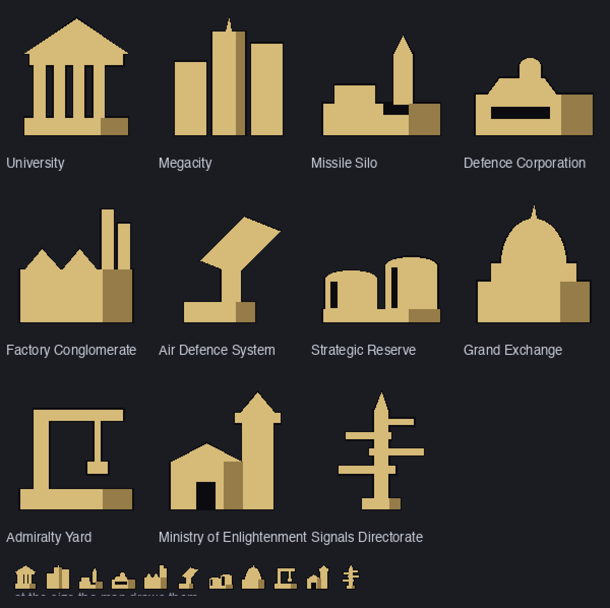

# Monuments

One great work per province, and a rent you pay for having it switched on.

A monument is not a second industry track. Industry is a number every province
has; a monument is a thing a country decides to have **one** of, somewhere
specific, at a price that rises the more of them it runs.

## The slots are the whole mechanic

Building one is cheap. Running one takes a **slot**, and slots get dear fast:

| slot | 1 | 2 | 3 | 4 | 5 | 6 | 7 |
|---|---|---|---|---|---|---|---|
| per turn | 50 | 75 | 125 | 200 | 300 | 425 | 575 |

That is `50 + 25·n(n−1)/2`, so there is a price for the eighth slot and the
eightieth. Four running monuments cost 450 a turn, which is real money.

Any monument can be switched **off**: it frees its slot and does nothing at
all. That is the dial. Eleven monuments and money for four means choosing which
four, every turn, and changing your mind when a war starts. Taking one down for
good costs 50 — a decision you can unmake for free is not a decision.

## Where the two decisions live

**Where it stands** is most of what a monument does, so you build one from the
province panel's Monuments tab. It lists what you have researched, greys out
what cannot go in *this* province, and says why.

**Which ones are running** is not about any place, so that is the Monuments
screen on the sidebar. Every row is a switch with the price of the slot it
takes beside it, in the order the slots are charged — read down the list until
the money runs out.

## What each one does

Every effect that scales does so on the province's **share of its country's
population**, saturating at a third: a university in a country's one great city
is a national institution, the same building in an empty province is a college.
And stacking decays harmonically — the second of a kind is worth a half, the
third a third — so five universities are worth about 2.28 of one, and "build
more" stops being the answer to everything.

| Monument | What it does | Reach |
|---|---|---|
| **University** | Raises research points on top of what your budget bought | national |
| **Megacity** | Migrants choose it — and *avoid* it across a border if your government is hostile to them | province + neighbours |
| **Missile Silo** | Fires any ordnance you have researched: 1,500 km, then 6,000, then anywhere on the planet | great circle |
| **Defence Corporation** | Lifts **both** sides' power near it. Movable. Destroyed by heavy ordnance | province + neighbours |
| **Factory Conglomerate** | Resource income here and next door | province + neighbours |
| **Air Defence System** | Rolls to stop an incoming strike outright | province + neighbours |
| **Strategic Reserve** | Raises the stockpile ceiling: bank a good year against a bad one | national |
| **Grand Exchange** | Sell for more, buy for less under duress. Must stand on a coast | national |
| **Admiralty Yard** | Repairs hulls in range every turn. Must stand on a coast | province + neighbours |
| **Ministry of Enlightenment** | Minorities come round faster — and away from you while you fight their kin | national |
| **Signals Directorate** | Spoils enemy aim: what does land does less. Movable. Fragile | province + neighbours |

Two of them move — the Defence Corporation and the Signals Directorate — to any
land you hold, for half of what they cost to get to their level. Both are
destroyed outright by anything heavier than heavy artillery. That is the trade:
they go where they are needed and they do not survive being found.

The silo's range is measured over a **great circle**, so the edge of the map is
not a wall, and its top level reaches further than half the planet's
circumference — at level 3 the answer is simply yes.

## Two things worth knowing

**A monument goes with the land.** Take a province and you take what stands in
it — and it starts costing you a slot rather than its old owner. Nothing is
destroyed by a change of flag; only heavy ordnance destroys a monument, and
only the two movable ones.

**The AI does not build them yet.** Monuments are a player's decision today,
the same way sector taxes are: every AI country leaves the screen alone, so
nothing here changes how the computer plays. Teaching it to use them is a
hand-written reflex rather than a retrain — see the note in `src/Monuments.h`
about the four consumers.

## What they look like



One silhouette per monument, built from a handful of flat parts in
`odmon::silhouette()` and drawn the same way on the flat map and on the globe.
The rule that keeps them legible is that the whole figure gets **one** light:
outline, fill, then a single shaded edge on the widest part standing on the
ground. Shading each part separately gave a university eight light sources and
made every building look like it had come apart.

They are checked by a test rather than by eye — every kind has a shape, every
shape stands on the ground and stays inside its box, no two kinds are the same
building, and any opening is cut into something solid.

## Researching them

A **Monuments** category in the research tree, with a root (*Monumental
Architecture*) that opens the screen at all, then three columns — civic,
commerce, war. The silo is last and dearest.

## For map scripts

```
if province.42.monument == "university"
    set x = province.42.monument_level
endif
```

`province.<id>.monument` is the **key** — `university`, `missile_silo` — and is
empty when there is none. `.monument_level` is 1 upwards, `.monument_active` is
whether it is switched on. The same three are available as `province.monument`
and friends inside a `foreach`.

Keys, not numbers: the catalogue is designed to be appended to, and a script
comparing against `2` would silently mean a different monument the day it is.

## For mods

Under the `GameState.Read` capability:

```wat
(import "gearbox:gamestate.read" "province_monument"        (func (param i32) (result i32)))
(import "gearbox:gamestate.read" "province_monument_level"  (func (param i32) (result i32)))
(import "gearbox:gamestate.read" "province_monument_active" (func (param i32) (result i32)))
```

`province_monument` returns a `monument_kind` (the enum is in `sdk/abi.json`)
or `-1` for none. The index rather than the key, because this is a numeric ABI
and a string would cost a buffer and a length on every call.

## In multiplayer

A client sends the whole set it holds each turn rather than a list of changes,
and the host rebuilds its copy through the same rules the panel uses — so a
client cannot place one in a province it does not own, one it has not
researched, a second in the same province, a port monument inland, or a level
the catalogue has no price for. An absence is a decision: a monument you
dismantled leaves the host's copy too.

## Where the code is

| | |
|---|---|
| `src/Monuments.h` / `.cpp` | the catalogue and its arithmetic; no game in it |
| `src/Game_Monuments.cpp` | the map half: where one stands, what it reaches |
| `src/Game_MonumentPanel.cpp` | the Monuments screen |
| `tests/monuments_test.cpp` | the rules, without a window |
| `tests/policy_rules_test.cpp` | that every kind reaches something, on a real map |
