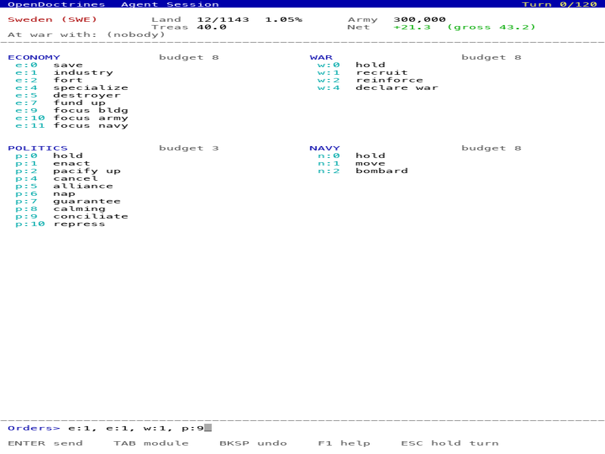
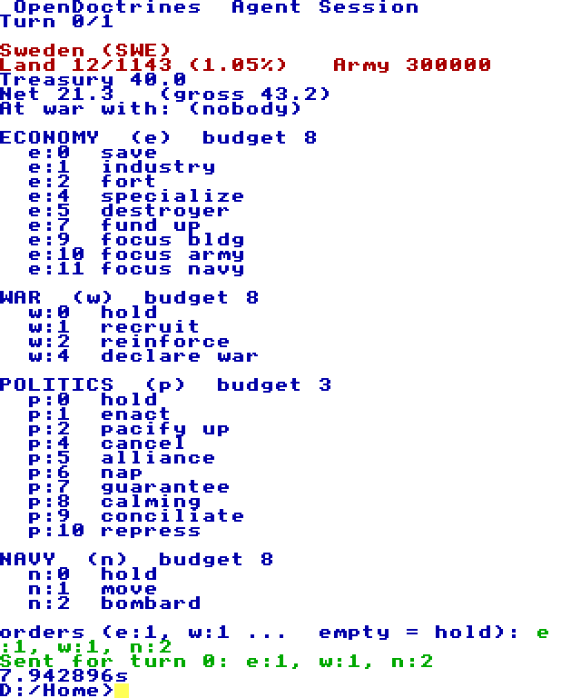

# Open Doctrines on TempleOS

**The game does not run here, and will not.** TempleOS has no C++ compiler, no
OpenGL and no network stack; Open Doctrines needs all three. What runs here is
the *other half* of a real game.

The engine's agent door prints a turn as plain text and reads one line of
`module:action` tokens back:

```
[AGENT] ===== turn 0/120  Sweden (SWE) =====
[AGENT] land 12/1143 (1.05% of the world)  army 300000  treasury 40.0
[AGENT] economy  e:0 save  e:1 industry  e:2 fort  e:4 specialize  ...
[AGENT] budget e:8 p:3 w:8 n:8
[AGENT] waiting
```



*The design mockup that settled the layout: turn 0 of `1914:SWE`, from a real
capture, drawn at the real size. Regenerate with `python3 templeos/mockup.py
<capture> out.png`. What the machine itself now draws is under Status.*

So a client has to read a file, draw 80×60 characters, and write a file. That
is inside what this OS offers, and the turn it plays is a turn of the actual
game — same map, same AI opponents, same rules.

**The host runs the engine. TempleOS runs the player.**

## Status

| | |
|---|---|
| Protocol pinned by a test | ✅ `tests/agent_protocol_test.sh` |
| Host bridge: a whole game as two files | ✅ `templeos/bridge.py`, tested |
| Reference client | ✅ `templeos/guest_sim.py` |
| Getting files into a guest | ✅ `templeos/vm.sh push` — TempleOS installs onto FAT32 |
| `OpenDoc.HC` compiles under HolyC | ✅ |
| `OpenDoc.HC` parses and draws a real turn | ✅ **on a real machine — screenshot below** |
| `OpenDoc.HC` sends orders back | ✅ the engine accepted a line typed in TempleOS |
| Files back out of the guest | ✅ `templeos/vm.sh pull` |
| A map you can see and click | ✅ `OpenDocUI.HC` + `tools/templeos_world.py` |
| Ethernet, ARP, IPv4, UDP | ✅ `templeos/Net.HC`, both directions |
| True colour | ✅ proven, `templeos/Gfx.HC` — see below |
| The rules running in TempleOS | ❌ next |



That is TempleOS V5.03 under QEMU, reading a turn the engine's agent door
actually printed: Sweden in 1914, twelve provinces of 1,143, an army of 300,000,
and the four menus it may act through. Everything on it came out of `[AGENT]`
lines; nothing is mocked. The line at the bottom was typed at that prompt, and
the file it wrote was handed to the engine, which played the turn:

```
turn 0: sent 'e:1, w:1, n:2'
bridge: 1 turn(s) exchanged. [BENCH] seat 1914:SWE (rung) for 1 turns
```

So the loop is closed: **the host runs the engine, TempleOS runs the player**,
and the only thing passing between them is a 23-byte file.

An action the menu did not offer is refused before it is written. The engine
drops a token it does not recognise without saying so, which from the guest is
indistinguishable from an order that was carried out — a typo would read as the
game ignoring you. Typing `e:3` when economy offers 0, 1, 2, 4, 5, 7, 9, 10, 11
gets *"ECONOMY has no action 3 this turn"* and writes nothing.

What is left is cadence, not capability: each exchange stops and restarts the
VM, because mounting a filesystem a running guest has open would corrupt it.
At one turn per hour that is irrelevant; for a rapid game it would not do.

## Networking

TempleOS ships no network stack, so `templeos/Net.HC` is the card, the frames,
the addresses and the checksums, all of it: an RTL8139 driver, ARP, IPv4 and
UDP in one file. Proven both ways -- the guest sent `hello from TempleOS` to a
listener on the host, and read `pong from the host` back.

An RTL8139 because its whole programming interface is a few registers and one
ring buffer. Polling rather than interrupts, because a turn-based game gains
nothing from an interrupt handler running at ring 0 next to the scheduler.

What made it short: TempleOS is *"always fully identity-mapped on all cores"*
(`Kernel/Sched.HC`), so a pointer **is** a physical address and the receive
buffer's address goes straight into the card's register. No translation, no
pinning.

The bug worth recording: **CAPR starts at -16, not 0.** The card treats the
read pointer as sixteen bytes behind the writer, so a ring initialised to zero
tells it the reader is ahead and nothing is ever delivered. The driver found
the card, reset it, read its MAC and received precisely nothing.

It is **not WiFi**, and that is not a gap to be filled later: 802.11 needs
per-chipset firmware, a MAC layer and a WPA2 supplicant, and a USB dongle would
need a USB stack this OS does not have. It is not TCP either -- no
retransmission, no ordering. ARP, IPv4 and UDP is what a turn game needs.

## Building it: use the live CD, and mount the disk

`tools/templeos_release.sh` boots the **ISO**, not the installed system, and
compiles there. That is not a workaround, it is the better arrangement: the CD
boots a complete TempleOS every time and nothing the build does can damage it,
whereas the installed system is the one thing here that accumulates state.

The CD does not mount hard drives by itself. `Mount;` -> drive letter `C` ->
all partitions -> probe -> device 1 defines C: and D:, and only then can the
sources on the disk be reached.

**That mount step cost an afternoon**, because its absence looks exactly like
disk corruption. `Cd("D:/Home")` threw `Except:Drv` out of `DrvChk`, I had
been hard-stopping the VM mid-write for days, and the installed system was
separately faulting at boot -- so "the partition is damaged" fitted everything
I could see. It was wrong. A freshly created partition, made minutes earlier
by TempleOS's own installer, threw the same error. The evidence equally
supported "not mounted", and I did not consider it until `Mount;` printed a
drive list with no hard drive in it.

## Is it a binary?

**Yes, now.** `dist/open-doctrines-templeos-<version>.zip` carries `ODBIN.BIN`
-- 881 KB of machine code with a `TOSB` signature, compiled ahead of time by
TempleOS's own compiler -- plus the world, the tables and the font. Build it
with `tools/templeos_release.sh`, which bakes the data, boots the guest, runs
`Cmp` inside it and takes the result back out. The VM is part of the build
because there is no cross-compiler and the artifact ought to be what that
machine actually produced.

Getting there took four discoveries, each of which looked like a bug in the
game and was not:

- **`Cmp` defaults its INPUT extension to `.PRJ`.** `Cmp("ODGame")` looks for
  `ODGame.PRJ.Z`, finds nothing, and reports `Errs:0 Code:0` -- a clean
  success that compiled nothing.
- **An AOT build starts with no C types at all.** `CmpJoin` chains a JIT
  compile onto the running system's symbol table and an AOT compile onto
  `cmp.asm_hash`, the assembler symbols. That is why `Cmp` on a two-line
  `U0 Hi(I64 n)` fails with *"Expecting type at I64"*: not the code, a build
  with no headers.
- **So the preamble is the whole trick**, and it is copied from
  `/Compiler/Compiler.PRJ`, this machine's own example of a module compiled
  against a kernel it does not contain. `KernelA.HH` for the types,
  `CompilerA.HH` for the `IC_*` intrinsic codes -- without those,
  `KernelB.HH`'s `public _intern IC_BSF I64 Bsf(...)` is "Invalid lval" --
  and `OPTf_EXTERNS_TO_IMPORTS` so the system's externs become names resolved
  by `Load()` instead of code emitted into the binary.
- **`public` is what exports a symbol**, and the entry point may not be called
  `OD`: the short name resolved to a class from the shell ("Invalid class at
  )"). It is `ODStart` now.

What is still not one command: launching it.

```
#include "RUN"                      loads the binary
U0 (*f)(U8 *w) = ODStart;           the symbol arrives as an ADDRESS
(*f)("world.odw");                  so it is entered through a pointer
```

A file is compiled in full before any of it runs, so a `Load()` on line one
leaves `ODStart` unknown to line two; `#exe` gets past that but declaring the
pointer in the same file faults. The shell manages it only because each
command line is compiled *and run* before the next is read. Three lines, and
the gap is written down rather than papered over.

## Running it yourself

```
templeos/vm.sh install                        # make the disk (once)
templeos/vm.sh boot                           # install TempleOS from the ISO
templeos/vm.sh push templeos/OpenDoc.HC turn.txt
templeos/vm.sh run
templeos/vm.sh shot /tmp/screen.png           # look, without a window
templeos/vm.sh pull orders.txt /tmp/          # bring the answer back
```

Then in the guest: `#include "OpenDoc"` and `OpenDoc;`.

A whole turn, host side:

```
python3 templeos/bridge.py --build build --dir /tmp/odloop --turns 1 &
templeos/vm.sh push /tmp/odloop/turn.txt      # ... play it in the guest ...
templeos/vm.sh pull orders.txt /tmp/odloop/   # the engine takes it from here
```

The ISO is not in this repository. Get it from templeos.org and check it
against their `md5sums.txt` before booting it.

## What the compiler and the machine actually said

Everything below was learned by running it. Each cost a round trip, and each is
the kind of thing no amount of reading finds.

1. **`sizeof` takes a type, not an expression.** `sizeof(t->country)` is not a
   size, it is `ERROR: Missing ')'` — reported against a line whose brackets
   are all balanced, which is a thoroughly misleading thing to be told. Buffer
   lengths are named constants now, used both in the class and at every call.
2. **`StrFirstOcc` takes a SET OF CHARACTERS, not a substring.**
   `StrFirstOcc(q, "army")` asks for the first `a`, `r`, `m` *or* `y` — which
   in "of the world" is the `r` of "world". This is why the client's first
   working run showed Sweden with no army and a treasury of `(d)`. The
   substring search is `StrMatch(needle, haystack)`. Single characters are
   fine, and correct usage.
3. **There is no `continue`.** Both loops that wanted one are if/else instead.
4. **There is no block scope.** A declaration anywhere in a function belongs to
   the whole function, so a second `U8 *q` in the next branch is not a new
   variable — it is `Duplicate member`, and the file does not compile. Every
   local in `ODParse` is declared once, at the top.
5. **`$$CM,x,y$$` does not lay out a screen.** The window is a scrolling
   document, not a grid you can address; placing every field by cursor move
   drew almost nothing. The display is composed line by line now, padded to
   columns, which survives being scrolled or resized.
6. **The window is half the screen.** The desktop gives a task the left ~40
   columns and keeps the right for its own help. `WinHorz` grants the full
   width but does not stop the help task painting over it, so the display
   measures its window and uses one column or two. Maximise it and it widens
   by itself.
7. **`%-2d` ignores the width flag** in `StrPrint`, so single digits are padded
   by hand.
8. **DolDoc escapes and `class`/`DocClear`/default arguments were all fine** as
   written — four of the five things the first draft of this file predicted
   would break did not.

## Producing a turn to feed it

On the host, in the Open Doctrines checkout:

```bash
mkfifo /tmp/a.fifo
./build/OpenDoctrinesServer --bench-agent 1914:SWE:rung /tmp/a.fifo \
    --until 120 --seed 20260801 --data data > turn.txt &
```

Wait for `[AGENT] waiting` to appear in `turn.txt`, then copy it into the
guest. That file is the whole input.

## The bridge

`templeos/bridge.py` runs the engine's door on the host and exchanges two files:

```
<dir>/turn.txt     written by the bridge; one turn, as the door printed it
<dir>/orders.txt   written by the player; one line of module:action tokens
```

It knows nothing about how that directory reaches a guest, deliberately — the
transport is the only part that needs a running TempleOS, so it is kept out of
the part that does not.

```bash
python3 templeos/bridge.py --build build --dir /tmp/odbridge
python3 templeos/guest_sim.py --dir /tmp/odbridge --turns 6   # in another shell
```

**Both files name their turn.** A file left from turn 4 looks exactly like one
written for turn 5, so `orders.txt` opens with `# turn 5` and anything else is
ignored and waited out. Timestamps are no help: they do not survive most ways of
getting a file across.

`tests/templeos_bridge_test.sh` plays five turns between two processes that
share only a path — the guest's situation minus the disk image — and asserts
that **every order the engine received is one the player wrote**.

That assertion was arrived at the hard way. Counting turns was not enough: with
the turn-number check deleted, the bridge ate a stale file, the guest answered
later turns instead, and both counts still came out right. The test passed with
the defence gone. Comparing content catches it, and so does planting the stale
file *during* a turn rather than before the run — a file planted first is
cleared on startup and never read.

## Getting files into a guest — solved, and more simply than expected

TempleOS has no networking — Terry Davis left it out deliberately — so **the
file is the network**:

```
host                                    guest (QEMU)
────                                    ────────────
engine writes turn.txt   ──▶  disk image  ──▶  OpenDoc reads it
engine reads orders.txt  ◀──  disk image  ◀──  you type a line
```

The expected difficulty was RedSea, TempleOS's own filesystem, and the plan was
a second image, or nbd, or vvfat. None of that was needed: **a default TempleOS
install lands on FAT32**, which macOS and Linux mount natively. `DrvRep;` in
the guest says so — `C FAT32 / D FAT32 / T ISO9660`. So the exchange is

```
stop the VM → mount the raw disk's second partition → copy → unmount → start
```

which is all `templeos/vm.sh push` does.

Two things that are not obvious:

- **The VM must be stopped.** Mounting a filesystem a running guest has open
  read-write corrupts both views of it. The stop is not a convenience.
- **A lower-case 8.3 name arrives shouted.** Other systems store `turn.txt` as
  a short entry with a "this was lower case" flag; TempleOS's FAT driver does
  not read that flag, so the file is `TURN.TXT` in the guest and opening it by
  the name you wrote fails. `OpenDoc.HC` is unaffected only because mixed case
  forces a long-name entry. The client tries both, so this is invisible now —
  but it is worth knowing before it costs somebody an afternoon.

**Turn cadence makes the cost irrelevant.** Open Doctrines' long-form
multiplayer already runs at one turn per hour to one per week. A bridge that
takes half a minute to hand a file across is not a problem at that pace — which
is why long-form is the mode to aim at, not a 2-minute rapid game.

## Why not port a C++ compiler instead

It is the wrong target, for two reasons.

**You would not need one.** clang on the host can already cross-compile. The
problem is not producing code, it is that TempleOS has nothing to run it
against: no libc, no libstdc++ (the STL, exceptions, RTTI, unwinding tables),
no threads for the 21 source files that use `std::thread`, no `mmap`, no
process model, no ELF loader, and its own ABI. That is writing a userland, not
porting a compiler.

**And it would not be enough.** raylib needs OpenGL; this OS has a 640×480
16-colour framebuffer and no GPU. Multiplayer needs TCP/IP; this OS has no
network stack and no NIC driver. A perfect toolchain gets you a binary that
cannot draw and cannot connect — you would still be writing a software renderer
and a TCP stack, which is the actual work either way.

If the goal is "TempleOS-flavoured but reachable", **ZealOS** is a maintained
fork with broader hardware support and is worth checking first. Whether it has
networking, I do not know.

## How this stays working

`OpenDoc.HC` depends on the *protocol*, not on the game. New scenarios, AI
retrains and renderer changes cannot touch it. The one thing that can is a
change to what `Game_Agent.cpp` prints — so that is pinned:

```bash
tests/agent_protocol_test.sh build
```

It runs the real door for one turn and asserts the shape of all ten lines a
client reads, plus the two-space separator between menu items, which is
load-bearing because action names contain single spaces. It runs in the normal
suite. It does **not** pin the numbers: a test that fails when the AI improves
is a test somebody deletes.

The checks were verified by breaking the protocol on purpose — renaming
`budget`, and collapsing the item separator to one space — and confirming each
is caught.
